# Automated Backup System in Azure

## Project Overview

This project builds an automated backup system in Azure using Terraform. The goal is to replace manual file backup processes with a cloud-based solution that supports file versioning, retention, lifecycle cost management, monitoring, alerting, and daily backup confirmation emails.

## Business Problem

Many small businesses rely on manual backups, which creates risk when files are forgotten, overwritten, deleted, or stored without a recovery plan.

This project solves that by creating a backup system that:

- Stores files in Azure Blob Storage
- Keeps previous versions of overwritten files
- Enables soft delete for blob and container recovery
- Moves older files to cheaper storage tiers using lifecycle policies
- Sends a daily backup confirmation email
- Monitors storage activity through Log Analytics and Azure Monitor

## Azure Services Used

- Azure Blob Storage
- Azure Storage Containers
- Blob Versioning
- Soft Delete
- Lifecycle Management Policies
- Log Analytics Workspace
- Azure Monitor Diagnostic Settings
- Azure Monitor Action Group
- Azure Monitor Alert Rule
- Azure Logic Apps
- Outlook.com Email Connector
- Terraform
- Azure CLI

## Architecture

The project deploys the following resources:

```text
rg-backup-kylon
├── Storage Account: stbackupkylon
│   ├── Container: documents
│   ├── Container: database-exports
│   ├── Container: application-files
│   ├── Blob versioning enabled
│   └── Soft delete enabled
├── Lifecycle Management Policy
│   ├── Move base blobs to Cool after 30 days
│   ├── Move base blobs to Archive after 90 days
│   ├── Delete base blobs after 365 days
│   └── Delete older versions after 30 days
├── Log Analytics Workspace
├── Storage Diagnostic Settings
├── Azure Monitor Action Group
├── Azure Monitor Alert Rule
└── Logic App daily confirmation workflow

## Terraform Deployment

The infrastructure was deployed using Terraform.

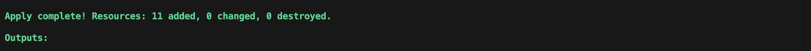

## Resource Group Overview

All project resources were deployed into a dedicated Azure resource group.

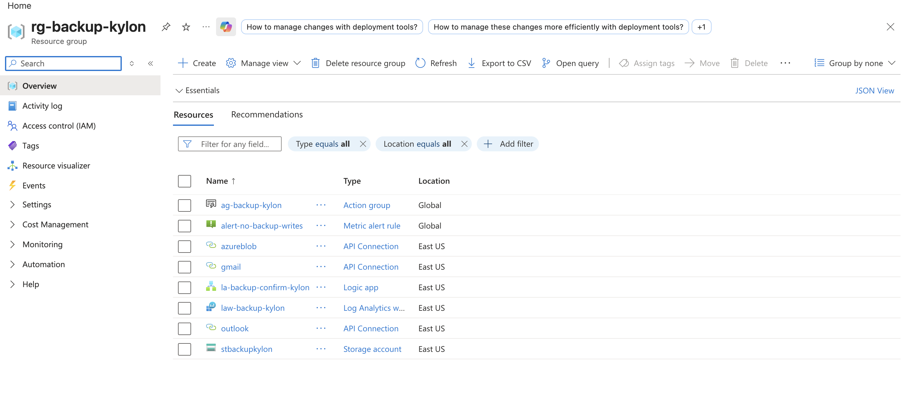

## Storage Account Overview

The storage account was configured with geo-redundant storage, TLS 1.2, blob versioning, and soft delete.

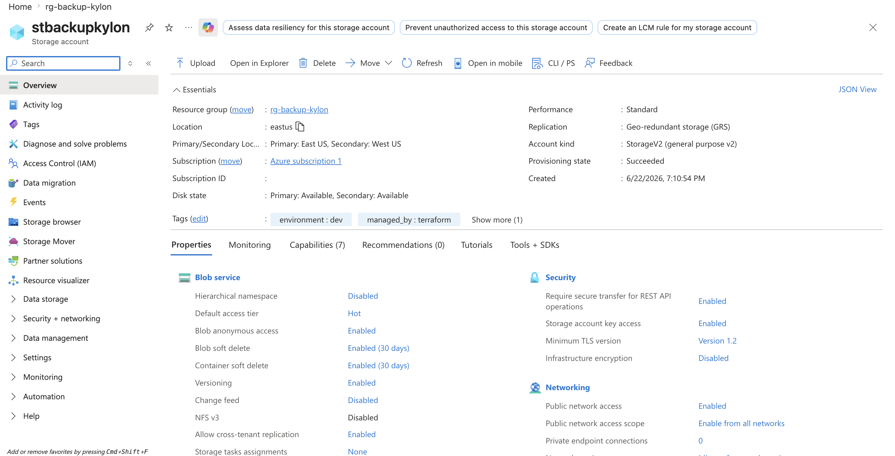

## Storage Containers

Three private containers were created to separate backup data by type.

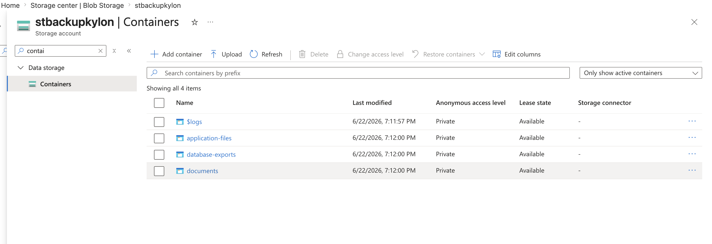

## Blob Versioning and Soft Delete

Blob versioning and soft delete were enabled to support recovery from accidental deletion or overwritten files.

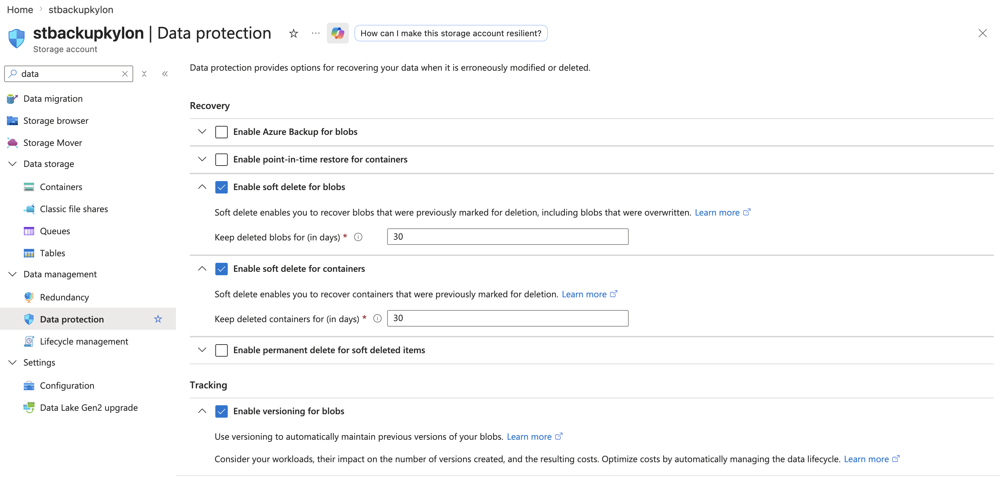

## Lifecycle Management

Lifecycle rules were configured to control storage costs by moving older files to cheaper tiers and deleting old versions.

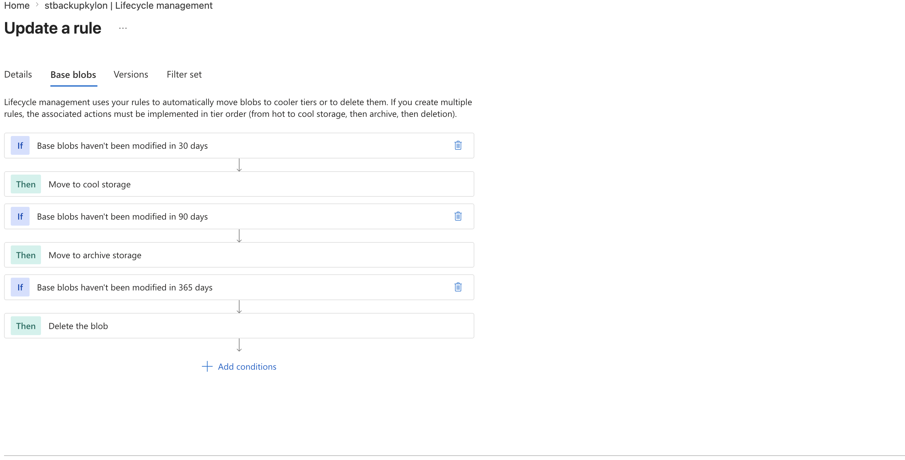

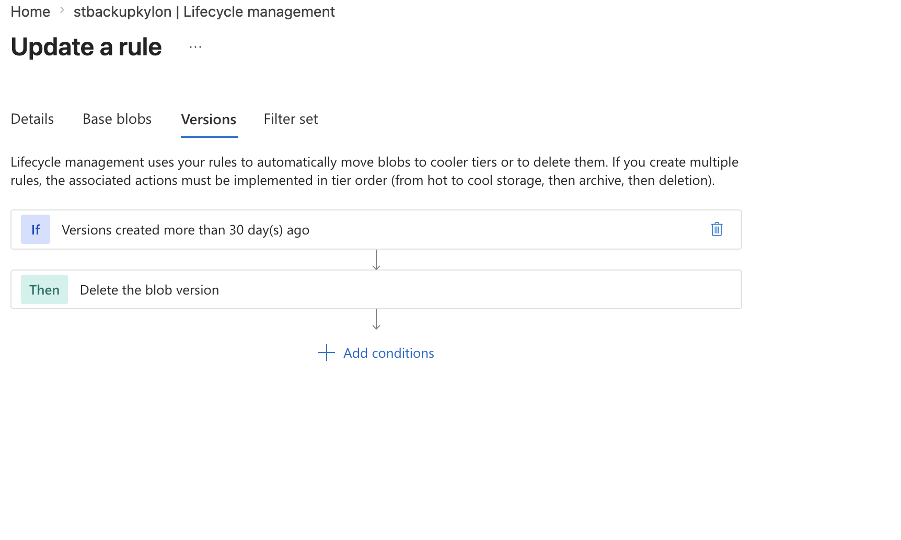

## Diagnostic Settings

Storage read, write, delete, and transaction logs were routed to Log Analytics.

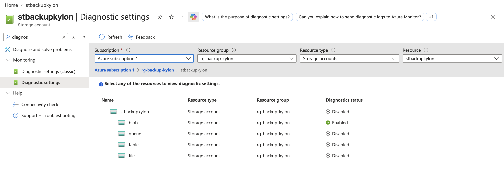

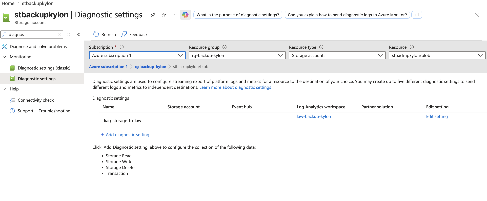

## Alerting

An Azure Monitor Action Group was created to support email notifications for backup-related alerts.

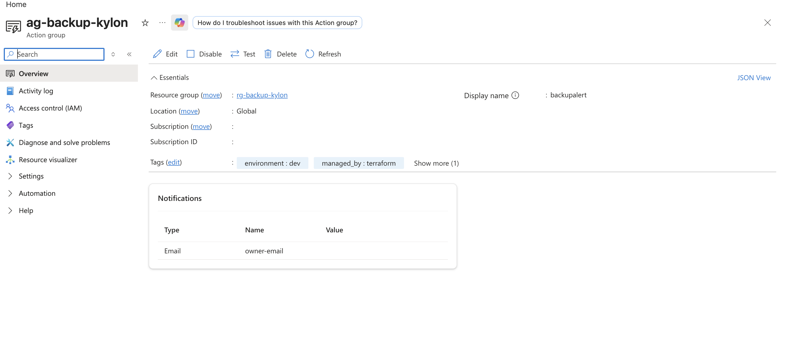

## Blob Versioning Test

A test file was uploaded, overwritten, and then listed with versioning enabled. The output showed multiple versions of the same blob, confirming that versioning worked correctly.

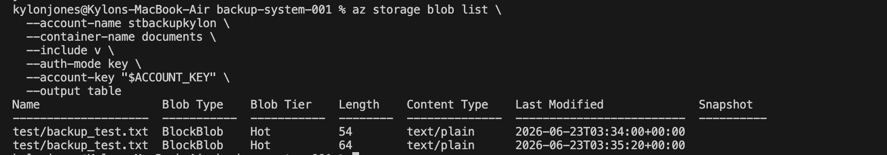

## Logic App Workflow

A Logic App was configured to check the backup container daily and send a confirmation email.

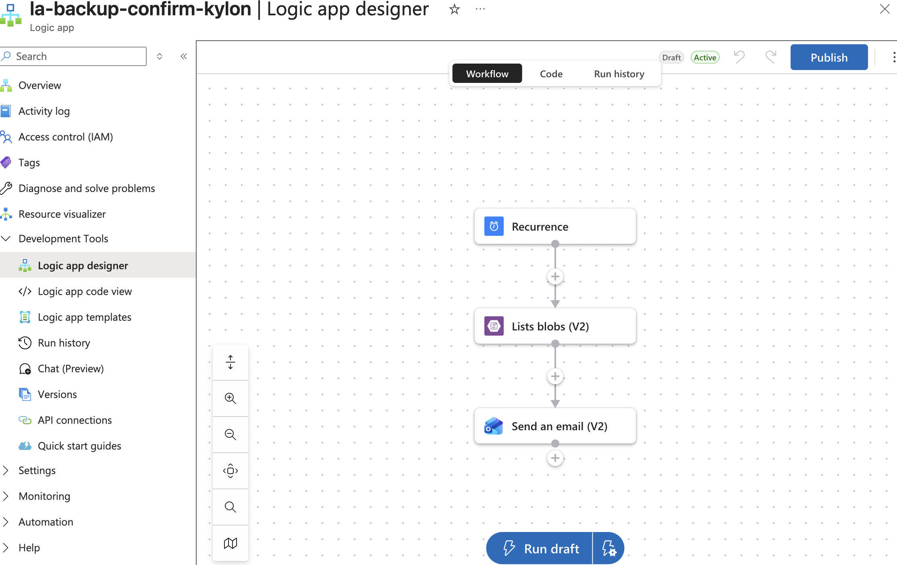

## Logic App Run History

The Logic App was manually tested and completed successfully.

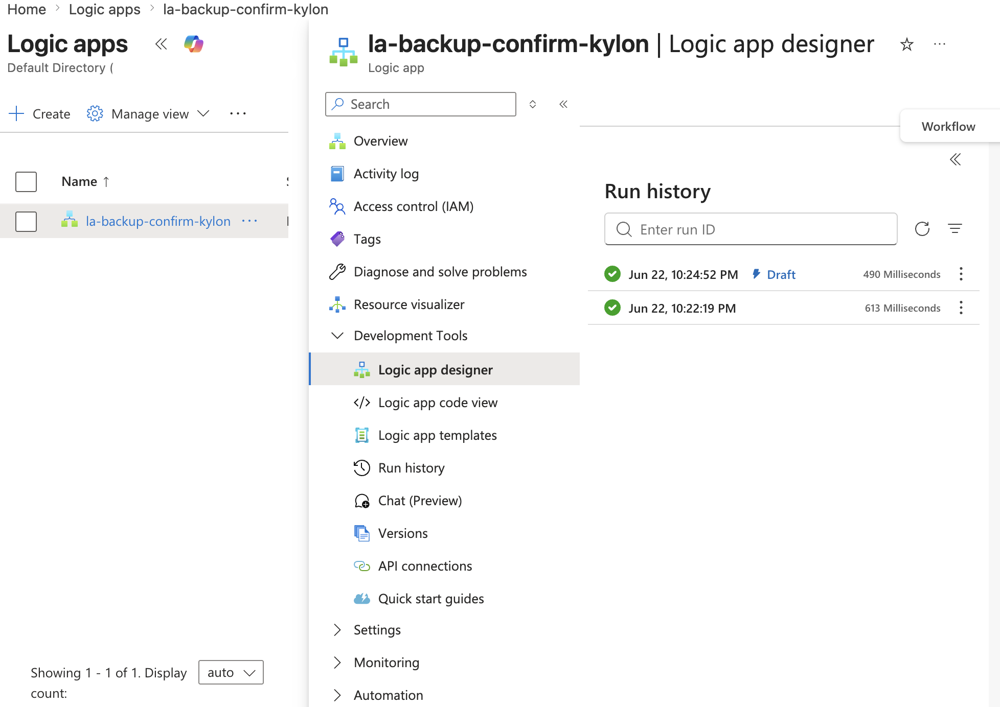

## Backup Confirmation Email

The Logic App sent a confirmation email showing the backup system was active and the documents container was checked.

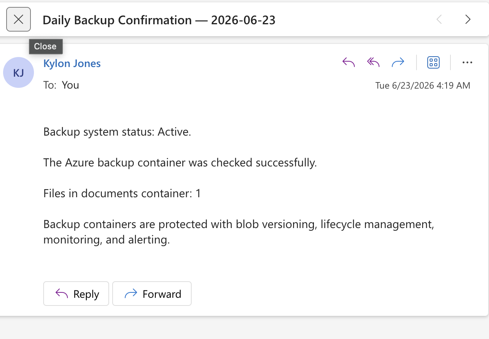

## Troubleshooting Notes

### Azure CLI Blob Upload Permission Error

While uploading a test blob using `--auth-mode login`, Azure returned a permissions error because the signed-in identity did not have the required Storage Blob Data Contributor role.

To continue the lab, the upload was completed using the storage account key.

### Gmail Connector Policy Error

The Gmail connector could not be used with the Azure Blob connector due to a Logic Apps connector policy restriction. The workflow was completed using an Outlook.com email connector instead.

## Cleanup

After the project was documented, resources were destroyed with Terraform to avoid unnecessary Azure costs.


## Skills Demonstrated

- Infrastructure as Code with Terraform
- Azure Blob Storage backup design
- Blob versioning and retention
- Storage lifecycle cost management
- Azure Monitor alerting
- Log Analytics diagnostic collection
- Logic Apps workflow automation
- Azure CLI troubleshooting
- Cloud documentation and cleanup
